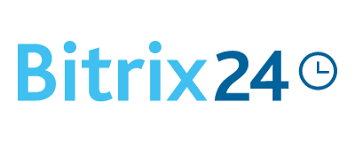

# 👋 Welcome

I work for the company full-time, and in my spare time I do freelance projects. I am glad to work on an interesting projects :)

🇬🇧 My CV: [download](https://raw.githubusercontent.com/vmrfriz/vmrfriz.github.io/master/data/Candidate_Valeriy_Grechukha_(vmrfriz).pdf) 
🇷🇺 Моё резюме: [скачать](https://raw.githubusercontent.com/vmrfriz/vmrfriz.github.io/master/data/%D0%92%D0%B0%D0%BB%D0%B5%D1%80%D0%B8%D0%B9%20%D0%92%D0%B0%D0%B4%D0%B8%D0%BC%D0%BE%D0%B2%D0%B8%D1%87%20%D0%93%D1%80%D0%B5%D1%87%D1%83%D1%85%D0%B0.pdf)

Telegram: [@vmrfriz](https://t.me/vmrfriz) 
Email: [v.mrfriz@gmail.com](mailto:v.mrfriz@gmail.com)

 

## 💻 Work experience

| Activity | Job place | Duration |
|-|-|-:|
| System Administrator (Windows) | Executive body | 4 years |
| Front-end, CMS, Laravel, parsing | Freelance | > 5 years |
| Business process optimization | PromTransportSerivce, LTD | 1 year |
| Bitrix Framework developer | FirstBit, LTD | 1.5 years |
| Laravel, server administration | carzaem.ru | 2.5 years |
| Laravel, Python, server administration | voen.info | from April, 1, 2024 |

 

## 🧳 Workflow

**CMS, Frameworks:**

&nbsp;

&nbsp;

&nbsp;

----

**CSS:**

&nbsp;

&nbsp;

&nbsp;

----

**JavaScript:**

&nbsp;

&nbsp;

----

**Other:**

&nbsp;

&nbsp;

&nbsp;

&nbsp;

&nbsp;

&nbsp;

&nbsp;

&nbsp;

----

**A little experience:**

&nbsp;

&nbsp;

&nbsp;

&nbsp;

&nbsp;

&nbsp;

&nbsp;

<!--

-->
